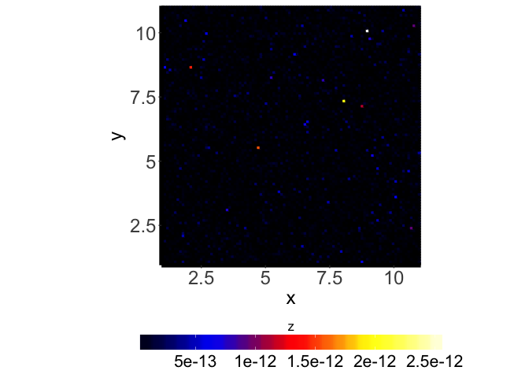
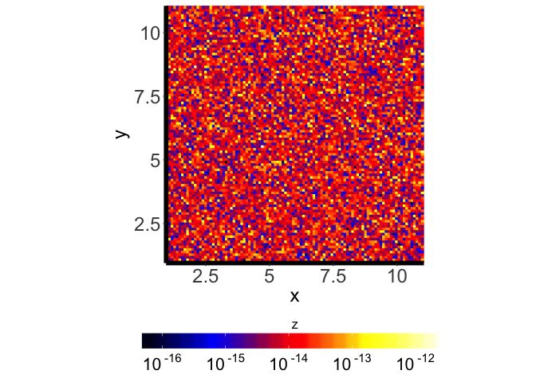
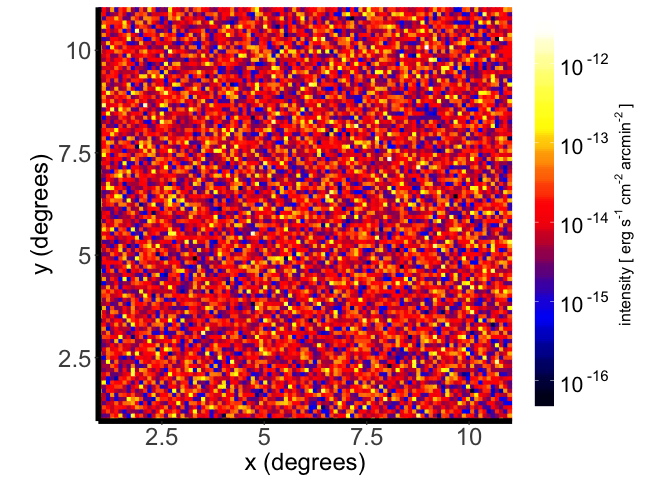

Prerequisites
-------------

You need to install the following packages: ggplot2, reshape2 and
RColorBrewer. If you plan to use plotimggg to convolve the arrays, you
also need to install spatialfil.

A reminder: to install these packages, you can run the following code:

    install.packages("ggplot2")
    install.packages("reshape2")
    install.packages("RColorBrewer")
    install.packages("spatialfil")

Basic usage
-----------

For it to make any sense to use pltimggg, you need to have a 2D array
and the corresponding vectors corresponding to each axis. In this
example we will generate a 100x100 array with axes spanning the interval
\[0, 1\].

    # source (do not forget to use the correct path to pltimggg.R)
    source("pltimggg.R")

    # define array dimensions
    nx <- 100
    ny <- 100

    # axes limits
    xlim = c(0e0, 1e0)
    ylim = c(0e0, 1e0)

    # compute axes
    x <- (0 : (nx - 1)) * (xlim[2] - xlim[1]) / (nx - 1) + xlim[1]
    y <- (0 : (ny - 1)) * (ylim[2] - ylim[1]) / (ny - 1) + ylim[1]

    # declare array
    img <- array(1e0, c(nx, ny))

    # fill array with random numbers in a certain interval
    img <- 10^(apply(img, c(1, 2), function(x) {rnorm(1, 0.5, 0.3) }) * 2e0) * 1e-15

Now we can try to plot the image using the default settings:

    pltimggg.plot2D(x, y, img)

It looks as expected. Let's plot the z values in the logarithimic scale:

    pltimggg.plot2D(x, y, img, zlog=TRUE)

We can also set the colourbar to be vertical, and the image will look
better:

    pltimggg.plot2D(x, y, img, zlog=TRUE, legend.direction = "vertical")

The labels of the axes and the colourbar can be changed:

    pltimggg.plot2D(x, y, img, zlog=TRUE, legend.direction = "vertical", xlab="x (degrees)", ylab="y (degrees)", zlab=expression(paste("intensity ["~"erg"~"s"^"-1"~"cm"^"-2"~"arcmin"^"-2"~"]")))

If we want to convolve the image we have to provide the kernel width
(FWHM of the Gaussian) in the units in which axes are measured:

    pltimggg.plot2D(x, y, img, zlog=TRUE, legend.direction = "vertical", xlab="x (degrees)", ylab="y (degrees)", zlab=expression(paste("intensity ["~"erg"~"s"^"-1"~"cm"^"-2"~"arcmin"^"-2"~"]")), conv.kernel = 0.015)

    ## [1] "Convolving with sigma =  0.015  (pixels =  1.485 )"

If we want the colourscale values to be printed in a different way (not
as powers of ten):

    pltimggg.plot2D(x, y, img, zlog=TRUE, legend.direction = "vertical", xlab="x (degrees)", ylab="y (degrees)", zlab=expression(paste("intensity ["~"erg"~"s"^"-1"~"cm"^"-2"~"arcmin"^"-2"~"]")), zlinformat=TRUE)

