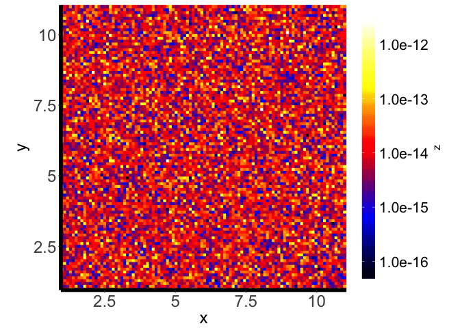
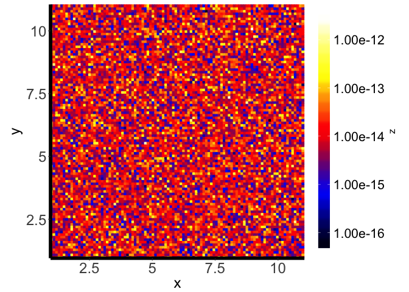
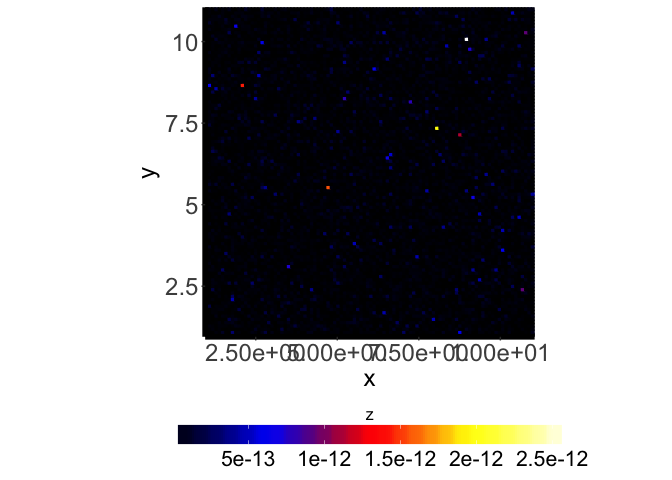
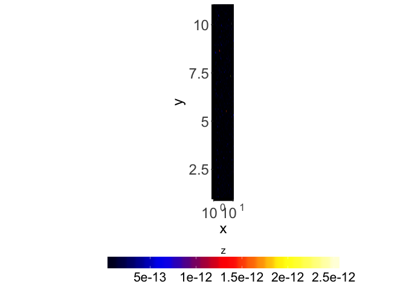
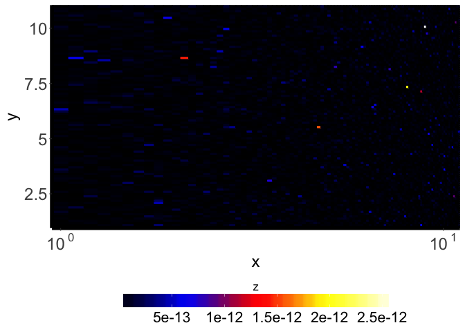
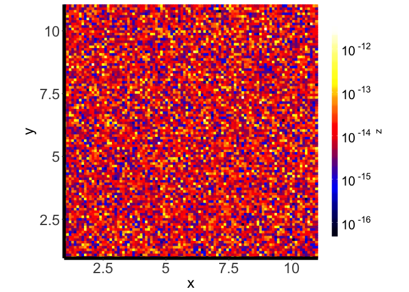
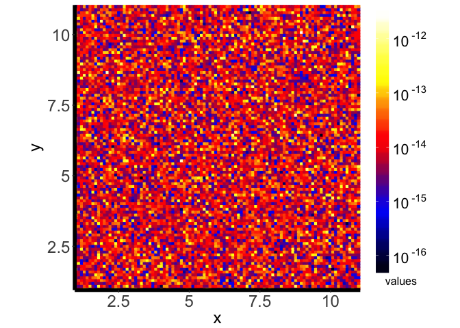
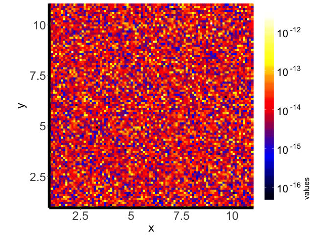

Prerequisites
-------------

You need to install the following packages: ggplot2, reshape2 and
RColorBrewer. If you plan to use plotimggg to convolve the arrays, you
also need to install spatialfil.

A reminder: to install these packages, you can run the following code:

    install.packages("ggplot2")
    install.packages("reshape2")
    install.packages("RColorBrewer")
    install.packages("spatialfil")

2D plots
--------

### Basic usage

For it to make any sense to use pltimggg, you need to have a 2D array
and the corresponding vectors corresponding to each axis. In this
example we will generate a 100x100 array with axes spanning the interval
\[0, 1\].

    # source (do not forget to use the correct path to pltimggg.R)
    source("pltimggg.R")

    # define array dimensions
    nx <- 100
    ny <- 100

    # axes limits
    xlim = c(0e0, 1e0)
    ylim = c(0e0, 1e0)

    # compute axes
    x <- (0 : (nx - 1)) * (xlim[2] - xlim[1]) / (nx - 1) + xlim[1]
    y <- (0 : (ny - 1)) * (ylim[2] - ylim[1]) / (ny - 1) + ylim[1]

    # declare array
    img <- array(1e0, c(nx, ny))

    # fill array with random numbers in a certain interval
    img <- 10^(apply(img, c(1, 2), function(x) {rnorm(1, 0.5, 0.3) }) * 2e0) * 1e-15

Now we can try to plot the image using the default settings:

    pltimggg.plot2D(x, y, img)

### Parameters

Now we review the parameters that can be passed to pltimggg.plot2D.

#### zlog: logarithmic scale for the values, default zlog = FALSE

To plot the image in logarithmic scale set zlog to TRUE:

    pltimggg.plot2D(x, y, img, zlog=TRUE)

#### legend.direction: colourbar direction, default legend.direction = "horizontal"

To plot the colourbar on the right set legend.direction to "vertical":

    pltimggg.plot2D(x, y, img, zlog=TRUE, legend.direction = "vertical")

#### xlab, ylab and zlab: axes and colourbar labels, default: "x", "y" and "z", respectively

The labels of the axes and the colourbar can be changed by giving the
appropriate values to xlab, ylab and zlab:

    pltimggg.plot2D(x, y, img, zlog=TRUE, legend.direction = "vertical", xlab="x (degrees)", ylab="y (degrees)", zlab=expression(paste("intensity ["~"erg"~"s"^"-1"~"cm"^"-2"~"arcmin"^"-2"~"]")))

#### conv.kernel: image convolution

If we want to perform a simple convolution of the image with a Gaussian
kernel we have to provide the kernel width (FWHM of the Gaussian) in the
units in which axes are measured. In our examples the axes go from 0 to
1. The following command convolves the image shown in the previous
example with a Gaussin kernel 0.015 units wide:

    pltimggg.plot2D(x, y, img, zlog=TRUE, legend.direction = "vertical", conv.kernel = 0.015)

    ## [1] "Convolving with sigma =  0.015  (pixels =  1.485 )"

#### zlinformat: colourscale values format, default zlinformat = FALSE

When the image is plotted in logarithmic scale, by default the colourbar
values are printed as powers of ten. If we want them to be printed in
the scientific notation we set zlinformat to TRUE:

    pltimggg.plot2D(x, y, img, zlog=TRUE, legend.direction = "vertical", zlinformat=TRUE)

#### zdigits: number of digits in the scientific notation, default zdigits = 1

By default only one digit is printed in the scientific notation. To use
2 set zdigits to 2 (note that this only has an effect when zlinformat =
TRUE or when plotting in a linear scale \[zlog = FALSE\]):

    pltimggg.plot2D(x, y, img, zlog=TRUE, legend.direction = "vertical", zlinformat=TRUE, zdigits = 2)

The parameter has no effect when the powers of ten are used:

    pltimggg.plot2D(x, y, img, zlog=TRUE, legend.direction = "vertical", zdigits = 2)

#### zbarwidth and zbarheight: colourbar width and height, default: zbarwidth = 20, zbarheight = 1

By default the colourbar is horizontal, its length is 20 (zbarwidth =
20) and its thickness is 1 (zbarheight = 1). If legend.direction is set
to "vertical" these values are interchanged by the routine itself.

To make the horizontal colourbar longer and thicker set zbarwidth to 25
and zbarheight to 2:

    pltimggg.plot2D(x, y, img, zlog=TRUE, zbarwidth=25, zbarheight = 2)

For the vertical bar remember that zbarwidth and zbarheight have the
opposite meaning than in the horizontal case. To reduce the length and
thickness set zbarheight to 18 and zbarwidth to 0.5:

    pltimggg.plot2D(x, y, img, zlog=TRUE, legend.direction = "vertical", zbarheight = 18, zbarwidth = 0.5)

#### ztitleposition: colourbar title position, default ztitleposition = "top"

By default, the position of the colourbar title is above the colourbar
in the horizontal case and to the right in the vertical case. To plot
the title below the vertical colourbar set ztitleposition to "bottom":

    pltimggg.plot2D(x, y, img, zlog=TRUE, legend.direction = "vertical", ztitleposition = "bottom", zlab="values")

Note that the title is rotated by 90 degrees, which is not something we
may necessarily want here. The next parameter can help.

#### zitleorientation: colourbar title orientation angle, default ztitleorientation = 0

By default, the title is printed horizonally (ztitleorientation = 0)
when the colourbar is horizontal, and vertically (ztitleorientation =
90) when it is vertical (this is automatically changed by the routine
when legend.direction is set to "vertical"). In the previous example we
may want to print the title horizontally and set ztitleorientation to 0:

    pltimggg.plot2D(x, y, img, zlog=TRUE, legend.direction = "vertical", ztitleposition = "bottom", zlab="values", ztitleorientation = 0)

#### ztitlehjust and ztitlevjust: title horizontal and vertical justification, default: 0.5 both

By default, the title is centered both horizontally and vertically
(ztitlehjust = 0.5 and ztitlevjust = 0.5). To justify left (bottom), set
ztitlehjust the value to 0, and for the right (right and top)
justification set it to 1.

Move the title to the top:

    pltimggg.plot2D(x, y, img, zlog=TRUE, legend.direction = "vertical", zlab="values", ztitlehjust = 0)

Move the title to the right:

    pltimggg.plot2D(x, y, img, zlog=TRUE, zlab="values", ztitlehjust = 1)

#### colours: colourscale to be used, default: internally defined rainbow

There is a rainbow colourscale defined internally. You can replace it by
your own colourscale. For example, to use grayscale you first generate
the colours useing e.g. colorRampPalette and then pass the result to
plotimggg.plot2D:

    myPalette <- colorRampPalette(c("black", "white"))(100)
    pltimggg.plot2D(x, y, img, zlog=TRUE, legend.direction = "vertical", colours = myPalette)

You can also combine the palettes. Let's add another two palettes,
usefull when particular ranges of values should be emphasized:

    myPalette <- c(colorRampPalette(c("black", "white"))(100), colorRampPalette(c("red", "blue"))(100), colorRampPalette(c("magenta", "orange"))(100))
    pltimggg.plot2D(x, y, img, zlog=TRUE, legend.direction = "vertical", colours = myPalette)

"Interesting" plots can be generated by shuffling the colours (not the
use of rbind() instead of c(), also white has been replaced by green):

    myPalette <- rbind(colorRampPalette(c("black", "green"))(100), colorRampPalette(c("green", "red"))(100), colorRampPalette(c("red", "blue"))(100))
    pltimggg.plot2D(x, y, img, zlog=TRUE, legend.direction = "vertical", colours = myPalette)

#### theme: ggplot theme to be used, default: internally defined theme

plotimggg.plot2D defines a reasonable black and white theme with some
adjustments for fonts. You can supply your own theme instead. For
exmple, to use the minimal theme set theme to theme\_minimal():

    pltimggg.plot2D(x, y, img, zlog=TRUE, theme = theme_minimal())

More information can be obtained by reading the ggplot documentation. Or
you can copy the definition of "mytheme" from the plotimggg.R and create
your own custom theme.
